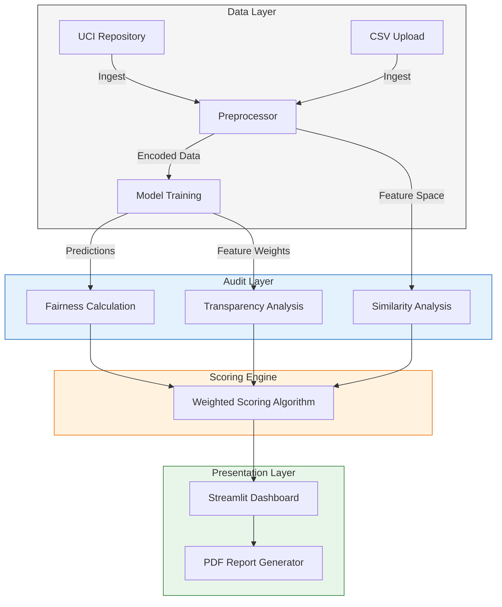

# Project Documentation: AI Ethics Compliance Inspector

## 1. Executive Summary
The **AI Ethics Compliance Inspector** is a specialized auditing tool designed to evaluate machine learning models for adherence to ethical principles. Originally developed for credit risk assessment scenarios (specifically the German Credit Dataset), the system provides a quantitative framework for measuring **Fairness**, **Transparency**, and **Consistency**.

The system operates as a **post-hoc audit layer**, meaning it analyzes the inputs and outputs of a trained model without requiring modification to the model's internal architecture. It generates a comprehensive PDF report detailing compliance scores, enabling stakeholders to make data-driven decisions regarding model deployment.

---

## 2. System Architecture

The application follows a modular architecture consisting of four primary layers:
1.  **Data Layer:** Handles data ingestion (UCI Repository or Local Upload), preprocessing, and encoding.
2.  **Model Layer:** Manages the lifecycle of the `RandomForestClassifier` used for decision-making.
3.  **Audit Layer (Ethics Engine):** Contains the core logic for Fairness (Statistical Parity), Transparency (Feature Importance), and Similarity (KNN) analysis.
4.  **Presentation Layer:** A Streamlit-based dashboard for configuration, visualization, and reporting.

### High-Level Architecture Diagram


---

## 3. Technical Specifications

The system is built on a Python-based stack, leveraging industry-standard libraries for scientific computing and web development.

| Component | Technology | Description |
|-----------|------------|-------------|
| **Runtime** | Python 3.10+ | Core application runtime. |
| **Frontend** | Streamlit | Rapid application development framework for data dashboards. |
| **Data Processing** | Pandas, NumPy | High-performance data manipulation and vector operations. |
| **Machine Learning** | Scikit-Learn | Implementation of `RandomForestClassifier` and `NearestNeighbors`. |
| **Reporting** | FPDF | Engine for programmatic PDF generation. |
| **Data Source** | UCIMLRepo | API client for fetching standardized datasets. |

---

## 4. Algorithmic Methodology

### 4.1 Fairness Analysis
The system evaluates **Statistical Parity Difference (SPD)**. This metric measures the difference in the acceptance rate (positive outcome) between a privileged group (e.g., Male) and an unprivileged group (e.g., Female).
*   **Formula:** $SPD = P(\hat{Y}=1 | A=Privileged) - P(\hat{Y}=1 | A=Unprivileged)$
*   **Interpretation:** A value close to 0 indicates fairness. Significant deviation indicates bias.

### 4.2 Transparency Analysis
The system utilizes **Feature Importance** derived from the Random Forest model. This calculates the decrease in node impurity (Gini Impurity) weighted by the probability of reaching that node.
*   **Output:** A ranked list of features (e.g., Account Status, Duration) influencing the decision.
*   **Validation:** The system verifies that the model is not a "black box" and can provide rationale for its decisions.

### 4.3 Similarity & Neighborhood Consistency
The system employs the **K-Nearest Neighbors (KNN)** algorithm to detect individual discrimination.
*   **Process:**
    1.  Map all individuals into a multi-dimensional feature space using Euclidean distance.
    2.  Mask sensitive attributes (e.g., Sex) during distance calculation.
    3.  For each individual, identify their $k$ nearest neighbors.
    4.  **Consistency Check:** If an individual receives a different outcome than their closest neighbors who differ only by sensitive attribute, a "Discordant Pair" is flagged.

### 4.4 Scoring Logic (AHP)
Final scoring utilizes a simplified **Analytical Hierarchy Process (AHP)** to aggregate metrics into a single 1-5 rating.
*   **Equation:**
    $$ FinalScore = \frac{\sum (Score_i \times Weight_i)}{\sum Weight_i} $$
    Where $i \in \{Fairness, Transparency, Similarity\}$.

---

## 5. Deployment Instructions

### Prerequisites
*   Python 3.8 or higher installed on the target machine.
*   `pip` package manager.

### Installation Steps

1.  **Navigate to Project Directory:**
    Open a terminal/command prompt and change directory to the project root.
    ```bash
    cd bilgisayarprojenew
    ```

2.  **Install Dependencies:**
    Execute the following command to install required libraries.
    ```bash
    pip install -r requirements.txt
    ```

3.  **Launch Application:**
    Start the local web server.
    ```bash
    python -m streamlit run src/ui/app.py
    ```

4.  **Access:**
    The application will be accessible at `http://localhost:8501`.

---

## 6. Verification Procedures

To ensure the integrity of the calculations, a verification script is provided. This script performs an independent manual calculation of all metrics using base Python/NumPy logic and compares them against the system's output.

**Execution:**
```bash
python verify_logic.py
```

**Validation Criteria:**
*   **Fairness Check:** Deviation $< 1e-5$
*   **Similarity Distance Check:** Deviation $< 1e-5$
*   **Score Calculation:** Precise equality.
