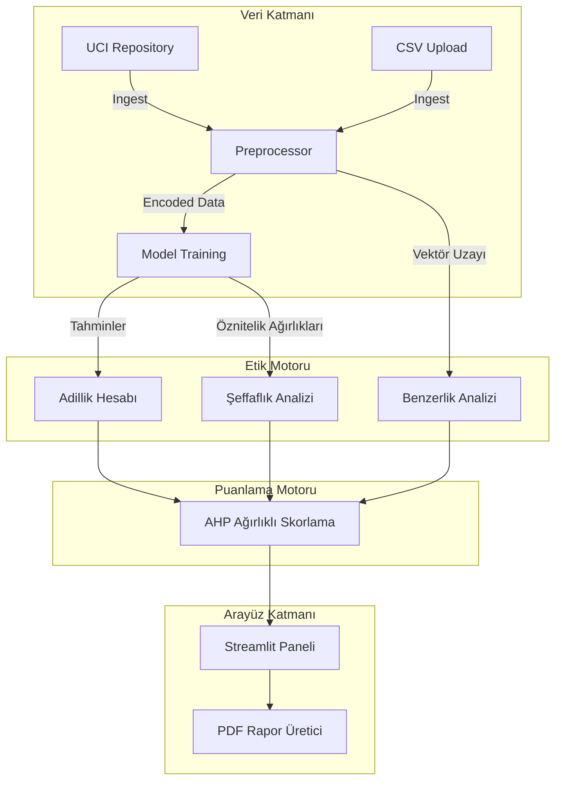

# Proje Dokümantasyonu: Yapay Zeka Etik Uygunluk Denetçisi (AI Ethics Inspector)

## 1. Yönetici Özeti ve Proje Amacı (Executive Summary)

Yapay zekâ (YZ) sistemlerinin hızla yaygınlaşmasıyla birlikte ortaya çıkan şeffaflık, adalet ve etik uygunluk sorunları, mevcut nitel etik denetim yaklaşımlarının yerine **nesnel ve ölçülebilir bir puanlama sistemi** ihtiyacını doğurmuştur.

Bu proje, YZ sistemlerinin etik uygunluğunu değerlendirmek için **Çok Kriterli Karar Verme (ÇKKV)** prensiplerine dayalı, nicel bir **Etik Uygunluk Puanlama Modeli** geliştirmeyi amaçlamaktadır. Araştırma; Adalet, Şeffaflık, Benzerlik (Tutarlılık) ilkelerini bağımsız değişken olarak ele almakta ve bu nitel prensipleri somut, sayısallaştırılabilir metriklerle nicel kriterlere dönüştürmektedir.

Kriterlerin göreceli önemleri, matematiksel tutarlılığı sağlamak amacıyla **Analitik Hiyerarşi Süreci (AHP)** yöntemiyle ağırlıklandırılmıştır. Geliştirilen algoritma, açık kaynaklı bir kredi değerlendirme modeli (German Credit Data) üzerinde test edilerek sistemin etik performansını temsil eden tek bir **Toplam Etik Uygunluk Puanı (1-5 arası)** hesaplamaktadır.

---

## 2. Sistem Mimarisi

Uygulama 4 ana katmandan oluşan modüler bir yapıya sahiptir:
1.  **Veri Katmanı:** Veri yükleme (UCI Repo veya CSV) ve ön işleme (Encoder/Scaler).
2.  **Model Katmanı:** Karar mekanizması olarak `RandomForestClassifier` kullanılır.
3.  **Denetim (Audit) Katmanı:** Adillik, Şeffaflık ve Benzerlik algoritmalarını çalıştırır.
4.  **Sunum Katmanı:** 7 Adımlı Streamlit Arayüzü.

### Mimari Şema

---

## 3. Adım Adım Çalışma Mantığı (Step-by-Step Workflow)

Sistem, kullanıcıyı 7 aşamalı bir "Sihirbaz" (Wizard) üzerinden yönlendirir. Her adımın detaylı işleyişi şöyledir:

### **Adım 1: Veri Yükleme (Data Loading)**
*   **İşlem:** Kullanıcı isterse sistemdeki hazır "Alman Kredi Verisi"ni kullanır, isterse kendi CSV dosyasını yükler.
*   **Arka Plan:** Veri `pandas` ile okunur. Kategorik veriler (Metin) sayısal verilere (0/1) dönüştürülür (`OneHotEncoding`). Sayısal veriler standartlaştırılır (`StandardScaler`).

### **Adım 2: Veri İnceleme (Data Inspection)**
*   **İşlem:** Yüklenen ham veri tablo olarak gösterilir.
*   **Amaç:** Kullanıcının verinin doğru yüklendiğini ve sütunların düzgün göründüğünü teyit etmesini sağlamak.

### **Adım 3: Model Eğitimi (Model Training)**
*   **İşlem:** "Modeli Eğit" butonuna basılır.
*   **Arka Plan:** `RandomForestClassifier` algoritması çalıştırılır. Model, başvuru sahibinin özelliklerine bakerek "Kredi Ver" veya "Verme" kararını öğrenir.

### **Adım 4: Benzerlik Analizi (Similarity Analysis)**
*   **İşlem:** Sistem, birbirine tıpatıp benzeyen ancak sadece hassas özelliği (örn: Cinsiyet) farklı olan kişileri tarar.
*   **Arka Plan:** `K-Nearest Neighbors (KNN)` algoritması kullanılır. Her birey için uzaydaki en yakın komşusu bulunur. Eğer model komşulara farklı karar verdiyse "Tutarsızlık" olarak işaretlenir.

### **Adım 5: AHP Ağırlıklandırma (Weighting)**
*   **İşlem:** Kullanıcı; Adillik, Şeffaflık ve Benzerlik kriterlerine 1 ile 9 arasında önem puanı verir.
*   **Arka Plan:** Verilen puanlar normalize edilir. Örn: Adillik %50, Şeffaflık %30, Benzerlik %20 gibi toplamı 100 olacak şekilde oranlanır.

### **Adım 6: Detaylı Analiz (Deep Dive)**
*   **İşlem:** Tüm hesaplamaların detaylı grafikleri (Adillik farkı, Öznitelik önem düzeyleri vb.) sunulur.
*   **Amaç:** Kullanıcının modelin iç yapısını ve nerede hata yaptığını görsel olarak anlaması.

### **Adım 7: Raporlama ve Final Skor (Reporting)**
*   **İşlem:** 1-5 üzerinden hesaplanan Nihai Etik Skoru görüntülenir ve PDF Raporu indirilir.
*   **Arka Plan:** Tüm metrikler ve ağırlıklar birleştirilir, PDF motoru (`fpdf`) ile dinamik bir doküman basılır.

---

## 4. Algoritmik Metodoloji

### 4.1 Adillik Analizi (Fairness)
*   **Metrik:** İstatistiksel Parite Farkı (Statistical Parity Difference - SPD).
*   **Mantık:** Avantajlı grup (örn: Erkek) ile dezavantajlı grubun (örn: Kadın) kredi onay oranları arasındaki farktır.
*   **Formül:** `SPD = P(Onay|Erkek) - P(Onay|Kadın)`
*   **Yorum:** Sonuç 0'a ne kadar yakınsa, model o kadar adildir.

### 4.2 Şeffaflık Analizi (Transparency)
*   **Metrik:** Küresel Öznitelik Önemi (Global Feature Importance).
*   **Mantık:** Model karar verirken hangi sütünlara (Yaş, Maaş vb.) ne kadar ağırlık verdiğini matematiksel olarak açıklar (Gini Impurity). Eğer model bu bilgiyi veremiyorsa "Kara Kutu" (Black Box) kabul edilir ve puan kırılır.

### 4.3 Benzerlik ve Tutarlılık (Similarity)
*   **Metrik:** Komşuluk Tutarlılık Oranı.
*   **Mantık:** Bireylerin en yakın komşularıyla aynı sonucu alıp almadığına bakılır. Benzer kişilere benzer sonuç çıkmalıdır.

### 4.4 Puanlama Mantığı (Scoring)
Nihai Etik Puan (1-5 Yıldız), belirlenen ağırlıklara göre şu formülle hesaplanır:

1.  **Ağırlıklı Toplam:**
    `WeightedSum = (AdillikPuanı * Ağırlık1) + (ŞeffaflıkPuanı * Ağırlık2) + (BenzerlikPuanı * Ağırlık3) / ToplamAğırlık`

2.  **1-5 Skalasına Dönüşüm:**
    `FinalSkor = 1 + (WeightedSum / 25)`

*(Not: 0 puan 1 yıldıza, 100 puan 5 yıldıza denk gelir).*

---

## 5. Kurulum Rehberi

**Gereksinimler:** Python 3.8+

1.  **Klasöre Girin:**
    `cd bilgisayarprojenew`

2.  **Kütüphaneleri Yükleyin:**
    `pip install -r requirements.txt`

3.  **Uygulamayı Başlatın:**
    `python -m streamlit run src/ui/app.py`

---

## 6. Doğrulama (Verification)

Hesaplamaların doğruluğunu kanıtlamak için, sistemin sonuçlarını manuel matematiksel işlemlerle karşılaştıran bir test betiği bulunmaktadır.

**Çalıştırmak için:**
`python verify_logic.py`
