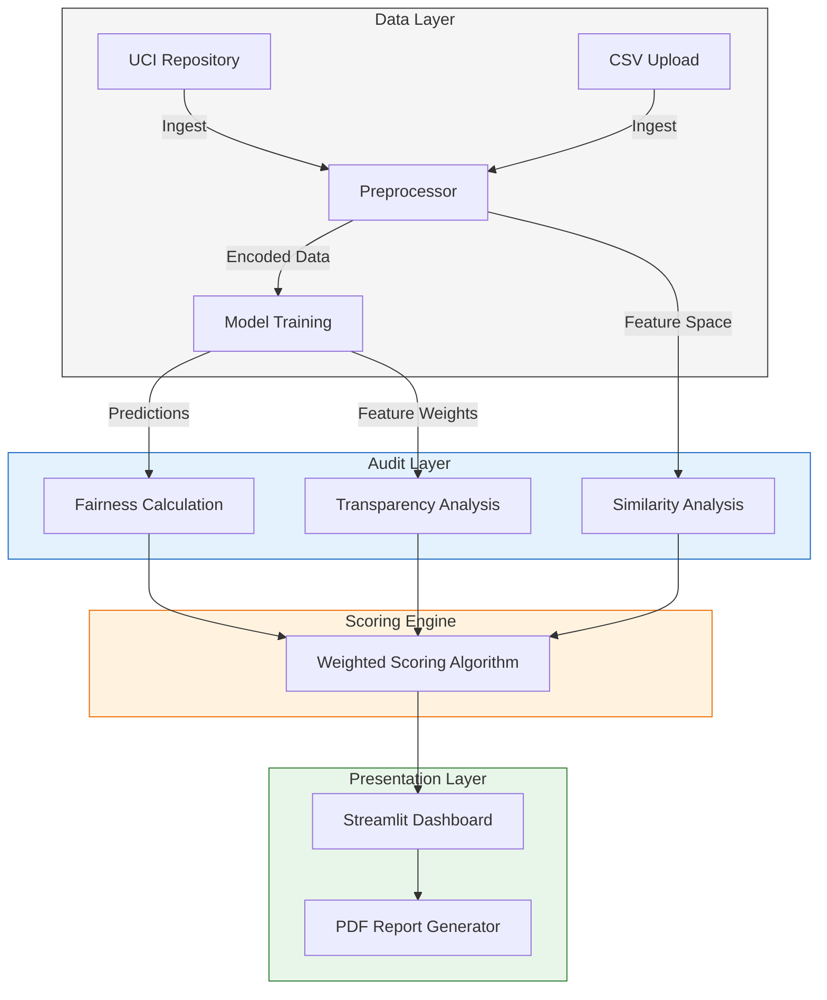

# Project Documentation: AI Ethics Compliance Inspector

## 1. Executive Summary
The **AI Ethics Compliance Inspector** is a post-hoc auditing tool designed to evaluate machine learning models (specifically **Random Forest Classifiers**) for adherence to ethical principles. It provides a quantitative framework for measuring **Fairness**, **Transparency**, and **Consistency** (Similarity).

The system allows users to audit the **German Credit Dataset** or upload their own tabular data (`.csv`). It generates a comprehensive PDF report detailing compliance scores, enabling stakeholders to make data-driven decisions.

---

## 2. System Architecture

The application follows a modular architecture consisting of four primary layers:
1.  **Data Layer:** Handles data ingestion (UCI Repository or CSV Upload), preprocessing (OneHotEncoding), and normalization.
2.  **Model Layer:** Manages the `RandomForestClassifier` used for decision-making.
3.  **Audit Layer (Ethics Engine):** Contains the core logic for Fairness (Statistical Parity), Transparency (Feature Importance), and Similarity (KNN) analysis.
4.  **Presentation Layer:** A 7-Step Streamlit Wizard for configuration, visualization, and reporting.

### High-Level Architecture Diagram


---

## 3. Technical Specifications

The system is built on a Python-based stack, utilizing the following specific libraries:

| Component | Technology | Description |
|-----------|------------|-------------|
| **Runtime** | Python 3.10+ | Core application runtime. |
| **Frontend** | Streamlit | Web-based interactive dashboard (7 Steps). |
| **Data Processing** | Pasdas, NumPy | Data manipulation and vector operations. |
| **Machine Learning** | Scikit-Learn | `RandomForestClassifier` (Training) and `NearestNeighbors` (Similarity). |
| **Reporting** | FPDF | Engine for programmatic PDF generation. |
| **Data Source** | UCIMLRepo | API client for fetching the German Credit dataset. |

---

## 4. Algorithmic Methodology

### 4.1 Fairness Analysis
The system evaluates **Statistical Parity Difference (SPD)**. This metric measures the difference in the acceptance rate between a privileged group (e.g., Male) and an unprivileged group (e.g., Female).
*   **Formula:** $SPD = P(\hat{Y}=1 | A=Privileged) - P(\hat{Y}=1 | A=Unprivileged)$
*   **Interpretation:** A value close to 0 indicates fairness.

### 4.2 Transparency Analysis
The system utilizes **Global Feature Importance** derived from the Random Forest model.
*   **Method:** Mean Decrease in Impurity (MDI).
*   **Validation:** If the model provides feature importance weights, it receives a Transparency score of 100. If identifying influential features fails (black box), it receives a penalty.

### 4.3 Similarity & Neighborhood Consistency
The system employs the **K-Nearest Neighbors (KNN)** algorithm ($k=2$) to detect individual discrimination.
*   **Process:**
    1.  Standardize numeric features.
    2.  Mask sensitive attributes (e.g., Sex) during distance calculation.
    3.  Find the closest neighbor for the target individual.
    4.  **Consistency Check:** If `Prediction(Target) != Prediction(Neighbor)`, it is flagged as a "Discordant Pair".
*   **Metric:** Similarity Score is calculated as $(1 - \text{Discordant Rate}) \times 100$.

### 4.4 Scoring Logic (AHP)
The Final Ethical Score (1-5 Stars) is calculated using a dynamic weighted average based on user input (Step 5).

*   **Equation:**
    $$ FinalScore = 1 + \frac{\text{WeightedSum}}{25} $$
    $$ \text{WeightedSum} = \frac{(S_{Fair} \times W_{F}) + (S_{Transp} \times W_{T}) + (S_{Sim} \times W_{S})}{W_{Total}} $$

---

## 5. Deployment Instructions

### Prerequisites
*   Python 3.8 or higher.
*   `pip` package manager.

### Installation Steps

1.  **Navigate to Project Directory:**
    ```bash
    cd bilgisayarprojenew
    ```

2.  **Install Dependencies:**
    ```bash
    pip install -r requirements.txt
    ```

3.  **Launch Application:**
    ```bash
    python -m streamlit run src/ui/app.py
    ```

---

## 6. Verification Procedures

To ensure mathematical integrity, a verification script (`verify_logic.py`) is provided. It performs independent implementation of the logic using standard NumPy operations.

**Execution:**
```bash
python verify_logic.py
```

**Validation Criteria:**
*   **Fairness Check:** System vs Manual Calculation ($< 1e-5$ tolerance).
*   **Similarity Check:** System (KNN) vs Manual Euclidean Calculation.
*   **Score Check:** System Formula vs Manual Formula.
