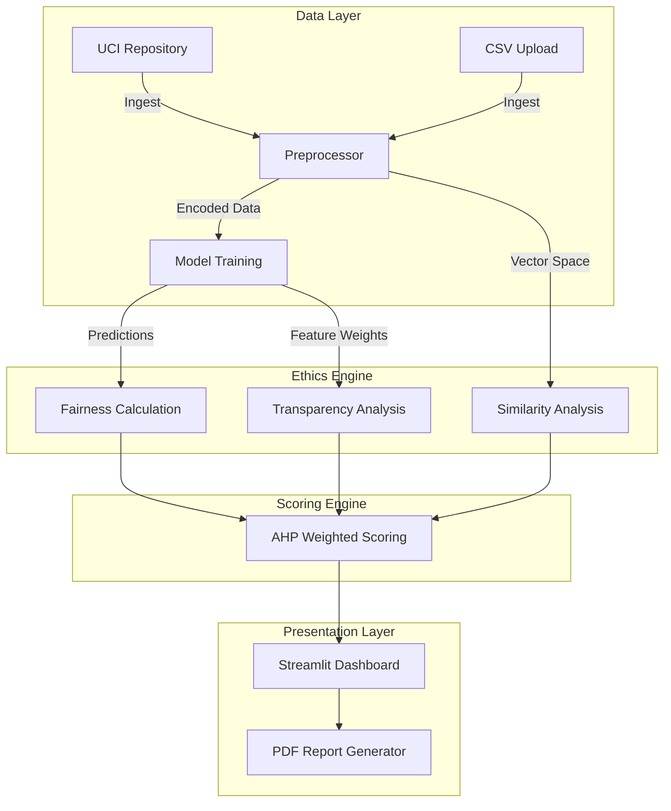
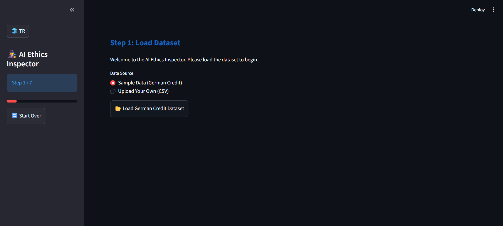
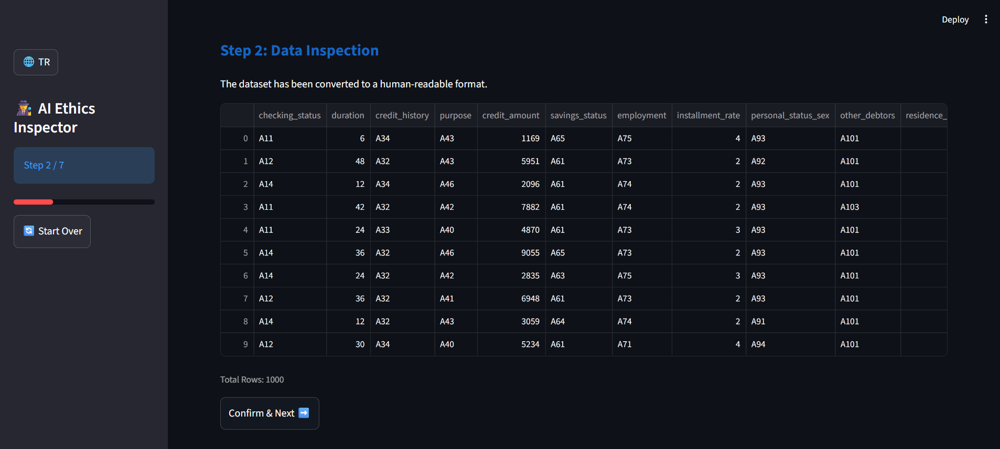
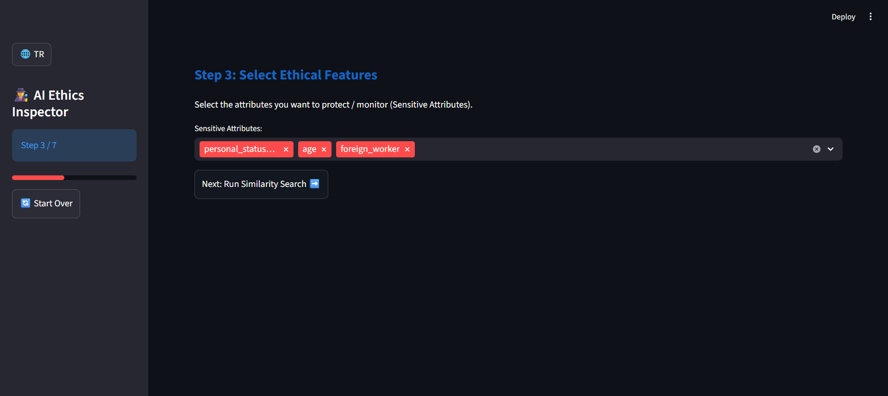
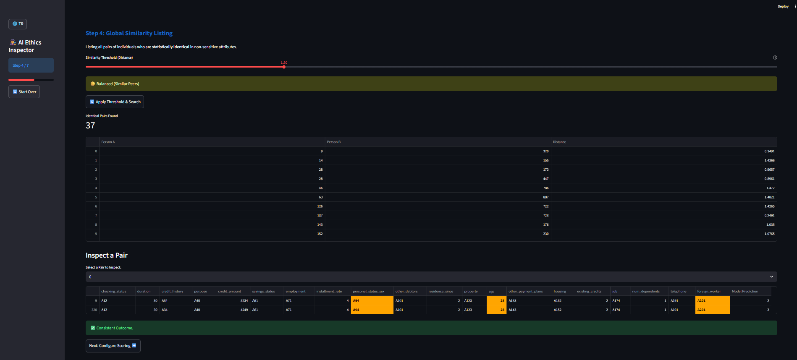
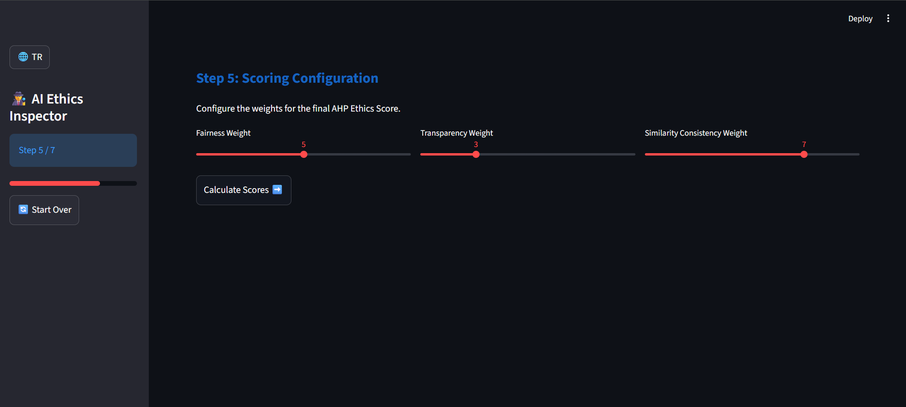
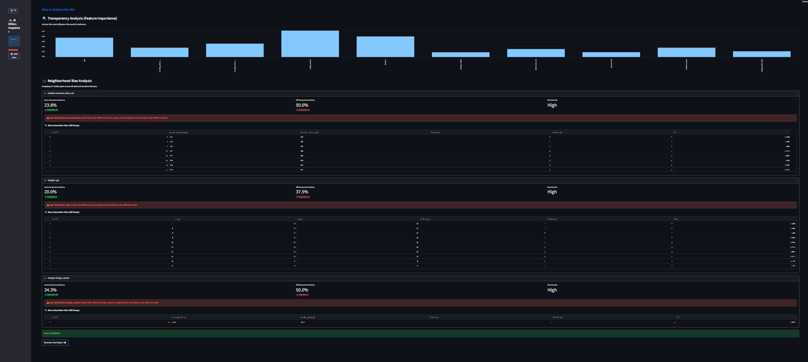
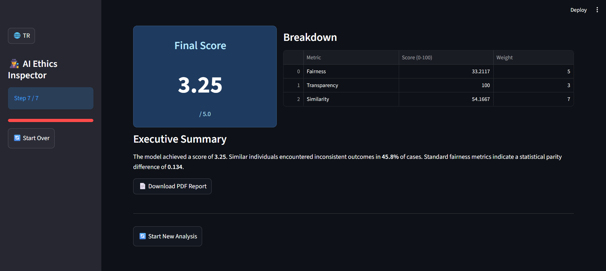

# Project Documentation: AI Ethics Compliance Inspector

## 1. Executive Summary & Project Objective

The rapid proliferation of Artificial Intelligence (AI) systems has necessitated a move beyond qualitative ethical auditing approaches towards **objective and measurable scoring systems** to address emerging issues of transparency, fairness, and ethical compliance.

This project aims to develop a quantitative **Ethical Compliance Scoring Model** based on **Multi-Criteria Decision Making (MCDM)** principles to evaluate the ethical alignment of AI systems. The research treats the core principles of Fairness, Transparency, and Consistency (Similarity) as independent variables, converting these qualitative principles into concrete, quantifiable metrics.

The relative importance of these criteria is weighted using the **Analytical Hierarchy Process (AHP)** to ensure mathematical consistency. The developed algorithm is tested on an open-source credit scoring model (German Credit Data) to calculate a single **Total Ethical Compliance Score (1-5)** representing the system's ethical performance.

---

## 2. System Architecture

The application features a modular architecture consisting of four primary layers:
1.  **Data Layer:** Data ingestion (UCI Repo or CSV) and preprocessing (Encoder/Scaler).
2.  **Model Layer:** Utilizes `RandomForestClassifier` as the decision mechanism.
3.  **Audit Layer:** Executes algorithms for Fairness, Transparency, and Similarity.
4.  **Presentation Layer:** A 7-Step Streamlit Interface.

### Architecture Diagram


---

## 3. Step-by-Step Workflow

The system guides the user through a 7-step "Wizard". The detailed logic for each step is as follows:

### **Step 1: Data Loading**

*   **Action:** The user selects either the built-in "German Credit Data" or uploads a custom CSV.
*   **Background:** Data is loaded via `pandas`. Categorical data is converted to numerical inputs (0/1) using `OneHotEncoding`. Numeric data is standardized via `StandardScaler`.

### **Step 2: Data Inspection**

*   **Action:** The raw loaded data is displayed as a table.
*   **Purpose:** Allows verification of successful data ingestion and column structure.

### **Step 3: Model Training**

*   **Action:** The user initiates the training process.
*   **Background:** A `RandomForestClassifier` is trained. The model learns to predict creditworthiness based on applicant attributes.

### **Step 4: Similarity Analysis**

*   **Action:** The system scans for individuals who are identical in non-sensitive attributes but differ in a sensitive attribute (e.g., Sex).
*   **Background:** Uses the `K-Nearest Neighbors (KNN)` algorithm. If the model assigns different outcomes to these "nearest neighbors", it is flagged as an inconsistency.

### **Step 5: AHP Weighting**

*   **Action:** Validates the relative importance of Fairness, Transparency, and Similarity (1-9 scale).
*   **Background:** Scores are normalized (e.g., Fairness 50%, Transparency 30%) to ensure they sum to 100%.

### **Step 6: Detailed Analysis**

*   **Action:** Visualizations of all detailed calculations (Fairness disparity, Feature Importance charts, etc.) are presented.
*   **Purpose:** To provide granular insight into the model's decision-making process.

### **Step 7: Reporting & Final Score**

*   **Action:** The Final Ethical Score (1-5) is displayed, and a PDF Report is generated.
*   **Background:** All metrics and weights are aggregated, and a dynamic document is rendered using `fpdf`.

---

## 4. Algorithmic Methodology

### 4.1 Fairness Analysis
*   **Metric:** Statistical Parity Difference (SPD).
*   **Logic:** The difference in acceptance rates between a privileged group (e.g., Male) and an unprivileged group (e.g., Female).
*   **Formula:** `SPD = P(Accept|Male) - P(Accept|Female)`
*   **Interpretation:** A result closer to 0 indicates higher fairness.

### 4.2 Transparency Analysis
*   **Metric:** Global Feature Importance.
*   **Logic:** Mathematically explains which columns (Age, Salary, etc.) the model prioritizes (Gini Impurity). If the model cannot provide this (Black Box), the score is penalized.

### 4.3 Similarity & Consistency
*   **Metric:** Neighborhood Consistency Rate.
*   **Logic:** Checks if individuals receive the same outcome as their closest neighbors. Similar individuals should be treated similarly.

### 4.4 Scoring Logic
The Final Ethical Score (1-5 Stars) is calculated using the weighted average defined in Step 5:

1.  **Weighted Sum:**
    `WeightedSum = (FairnessScore * W1) + (TransparencyScore * W2) + (SimilarityScore * W3) / TotalWeight`

2.  **1-5 Scale Conversion:**
    `FinalScore = 1 + (WeightedSum / 25)`

*(Note: 0 points = 1 Star, 100 points = 5 Stars).*

---

## 5. Installation Guide

**Requirements:** Python 3.8+

1.  **Navigate to Directory:**
    ```bash
    cd bilgisayarprojenew
    ```

2.  **Install Dependencies:**
    ```bash
    pip install -r requirements.txt
    ```

3.  **Launch Application:**
    ```bash
    python -m streamlit run src/ui/app.py
    ```

---

## 6. Verification

To verify the mathematical accuracy of the system, a script comparing system outputs against manual calculations is included.

**Run Verification:**
```bash
python verify_logic.py
```
